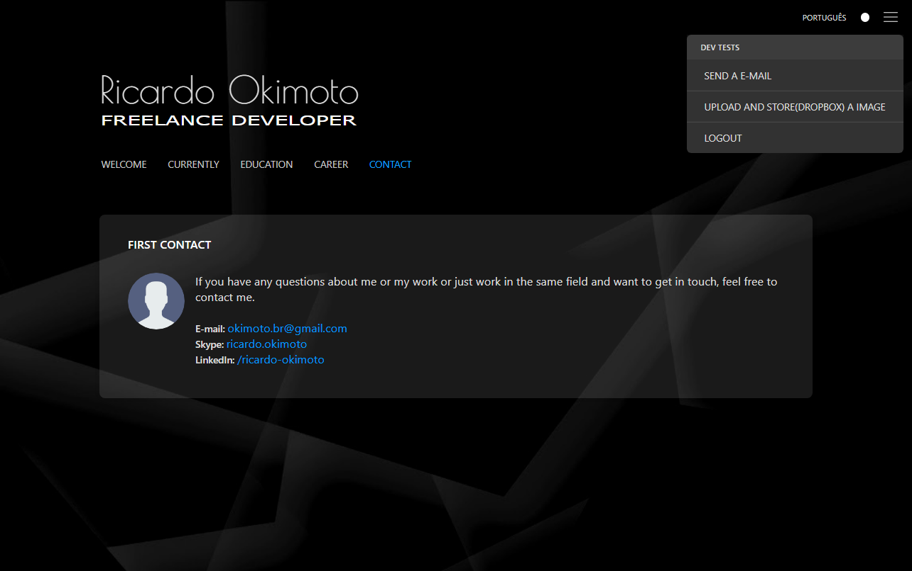
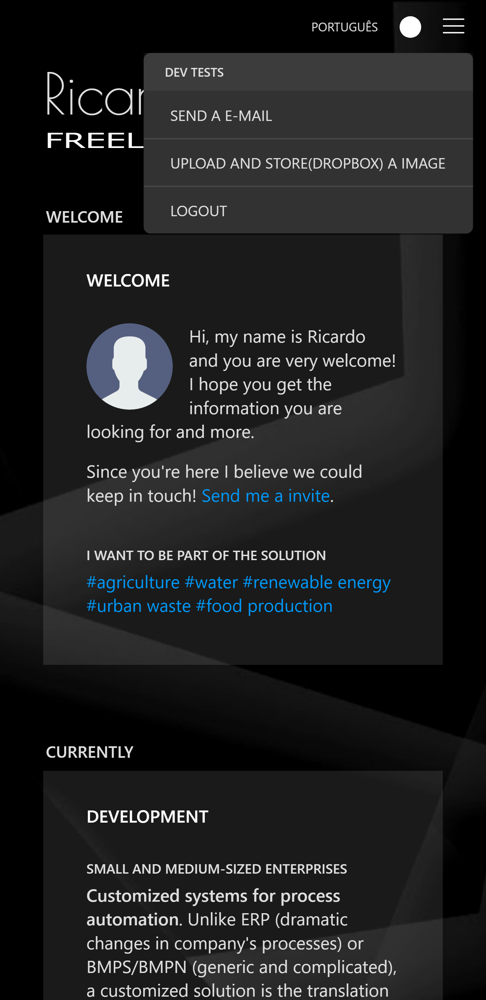
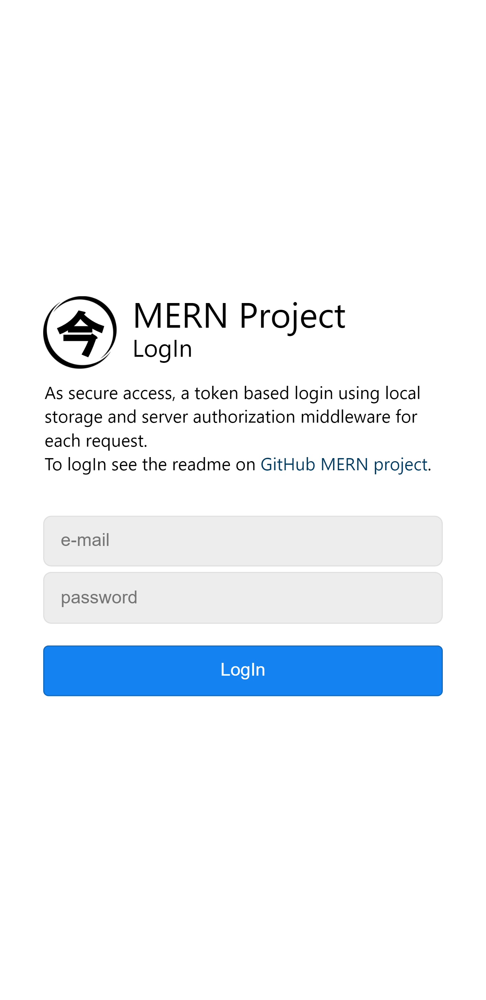
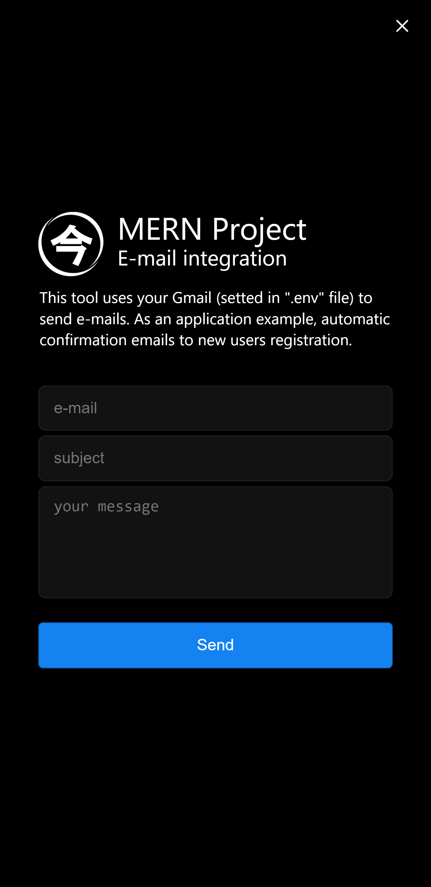

# MERN Project

This project has some of the features I use in most of my full-stack (Customized systems for process automation) projects. Here I just used my [homepage](https://github.com/Okimas/home) project as front-end with some options to test the integration with back-end. Main features:

- secure login and requests

- database backup (local and Dropbox)

- file upload (local and Dropbox)

- e-mail integration

### Screens

    

    
    
    

## What is needed

### node.js

Create a file `.env` with this variables:

- APP_KEY=YOUR KEY
- SERVER_PORT=YOUR PORT
- FRONTEND_FOLDER=build (React production files)
- MONGO_URL=mongodb://localhost:27017/github
- DROPBOX_TOKEN=YOUR DROPBOX APPLICATION TOKEN
- EMAIL_ADDRESS=YOUR EMAIL (GMAIL)
- EMAIL_PASSWORD=YOUR EMAIL PASSWORD

### mongoDB

In `./src-backend/extra` folder I left two json files for each collection of our mongo database that I named `github`.
The password for the user `email@gmail.com` is `12345678`.

### Dropbox Account

On your Dropbox account create a application and get a token for it. In `.env` file, set the value for `DROPBOX_TOKEN`.

### Gmail Account

In your Gmail account (Manager) you will need to enable "allow app less secure" in order to send e-mails through code.

### React

I used `Create React App` to start the project. When the user interface was ready I created the folder `./src-backend` and start the node aplication in same project (in this case works well).

###### \* You can find all versions and extra packages in `package.json`.

### RUN `node ./src-backend/index.js`
